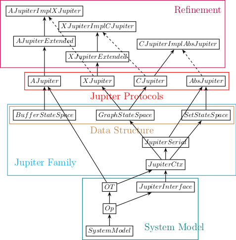

# Jupiter-Refinement-Project
Anonymous Repository

## What is this project about?
This project is devoted to
"formal specification and verification of a family of Jupiter protocols 
for implementing replicated lists".

Jupiter protocol is a core of many collaborative editing systems.

## TLA+ Modules (`tla/`)
The following figure shows the key modules in this project,
where the solid line from module A to module B indicates that B "extends" A,
and the dashed line from module A to module B indicates that B contains an "instance" of A.



These modules fall into four categories:
- System Model:
  It describes the client/server architecture of collaborative editing systems.

  It also models a replica as an abstract state machine 
  and provides the interface for implementing such a state machine.
- Jupiter Family: 
  This contains several techniques for all Jupiter protocols.
  - `JupiterCtx` is for context-based Jupiter protocols.
  - `JupiterSerial` helps to establish the serialization order at the server.
  - `BufferStateSpace`, `GraphStateSpace`, `SetStateSpace` are data structures for supporting OTs in Jupiter protocols.
- Jupiter Protocols: 
  Formal TLA+ specifications of four Jupiter protocols, 
  namely `AJupiter`, `XJupiter`, `CJupiter`, and `AbsJupiter`.
- Refinement: 
  The (data) refinement relations among Jupiter protocols are established.
  Specifically, 
  - `AJupiter` is a refinement (a.k.a implementation) of `XJupiter`,
  - `XJupiter` is a refinement of `CJupiter`, 
  - `CJupiter` is a refinement of `AbsJupiter`.

### Requirements
- JRE 8 (*Not* tested on any lower or higher versions)

### Experiments
Now, the script checks two kinds of properties:
1. the refinement relation among a family of Jupiter protocols.
Specifically, it checks that 
- `AJupiter` is a refinement of `XJupiter` (expressed in `AJupiterImplXJupiter`),
- `XJupiter` is a refinement of `CJupiter` (expressed in `XJupierImplCJupiter`), and
- `CJupiter` is a refinement of `AbsJupiter` (expressed in `CJupiterImplAbsJupiter`).
2. the correctness of these Jupiter protocols with respect to the weak list specification (`WLSpec`).
Due to the refinement relation above, it only needs to check that 
- `AbsJupiter` (more precisely, `AbsJupiterH`) satisfies `WLSpec`.

### Parameters
For each of these four properties to check,
we vary the number of client replicas (#Clients) from 1 to 5
and the number of chars (#Chars) allowed to insert from 1 to 5.

For the settings of (#Clients, #Chars) = (3, 3), (2, 4), and (2, 4),
we exit TLC when the number of distinct states TLC examines reaches a given threshold.
For `AbsJupiter`, the threshold is 100, 000, 000,
while for the others, it is 80, 000, 000.

## How to run?

Each of the following command conducts the model checking experiments described above in batch,
and it is allowed to set the number of worker threads.

### Commands

#### On Linux
```bash
# Usage Note: In the following three commands, "make" is identical to "make run".
make		# using 10 workers by default (used in our setting)
make WORKERS=2  # using 2 workers
make WORKERS=   # setting the number of workers as that of physical cores in your machine
```

#### On Windows
```
cd protocols
python ..\jupiter-experiments.py ..\mc_result 10
```

### Output: 
The model checking results are stored in a subdirectory (named with the timestamps it is generated)
in the `mc_result` directory, consisting of 

- A markdown table containing all raw (statistic) data.
- Four markdown tables, one for each property to check.
- Four LaTeX tables which can be used in paper, one for each property to check.

An incomplete sample model checking result (only for (1,1) and (1,2)) is given in `20190207-162510-sample`.

A complete sample model checking result (only the LaTeX tables) is given in `mc_result/all`.

### To stop:
- `Ctrl + C`: Stop the individual experiment currently in running
- `Ctrl + \`: Stop the whole batch of experiments

> Warning: When it is interrupted by `Ctrl + C` or `Ctrl + \`, 
some tables may be incomplete or even be not generated.
